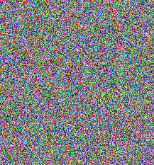
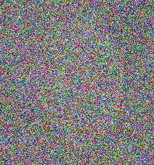
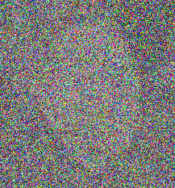
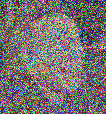
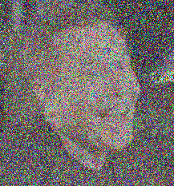
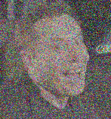
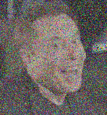
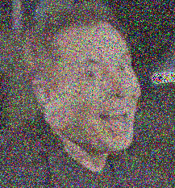

# Reproducer

Reproducer is an image reproduction project with genetic algortihm. It's extended and improved implementation (more accurate and faster reproduction for all colors) of <a href="https://github.com/ahmedfgad/GARI">ahmetdfgad/GARI</a> project.

## Installation

- Clone the repository.
- `$ cd reproducer && virtualenv venv`
- `source venv/bin/activate`
- `pip install -r requirements.txt`
- Specify an image path in the code (which is in main function)
- Specify width and height multiplier in main function if you want to resize picture or have faster iterations.
- Specify the iteration count, default is `10m`.
- `$ python3 reproducer.py`
- You can find outputs in `points/` folder.

## Strategies

- If you lower your picture resolution, you'll have more accurate reproduced images. Also `reproducer` will work faster.
- If you want to have faster reproduction and also same resolution, you can use upscalers like <a href="https://github.com/idealo/image-super-resolution">image-super-resolution</a>.
- You can reproduce your friends' photos and let them use their reproduced photos as profile photo! That's funny, strongly recommended.
- Mostly, below 400x400 images are over 90% percentage being reproduced well in `5m` iterations.

## Example (Thanks to <b>Elon Musk</b>)

<table>
<tr>
  <th>Iterations: 0</th>
  <th>Iterations: 5k</th>
  <th>Iterations: 10k</th>
  <th>Iterations: 50k</th>
</tr>
<tr>
  <td></td>
  <td></td>
  <td></td>
  <td></td>
</tr>
<tr>
  <th>Iterations: 100k</th>
  <th>Iterations: 250k</th>
  <th>Iterations: 500k</th>
  <th>Iterations: 1m</th>
</tr>
<tr>
  <td></td>
  <td></td>
  <td></td>
  <td></td>
</tr>
</table>
